# 第一章-Linux基础(实验)

## 一、实验目标：

- 手动安装并配置Ubuntu20.04。
- 通过制作**user-data&meta-data**的ISO文件，完成虚拟机无人值守安装Ubuntu20.04。
- 理解并掌握通过sftp在虚拟机和宿主机之间传输文件的方法。
---

## 二、实验环境：

- virtualbox vm
  </br>
  ubuntu20.04 server 64bit
- windows 10
---

## 三、实验步骤：

### 1. 手动在虚拟机中安装好Ubuntu20.04实验环境,配置网络完毕，登陆完毕。
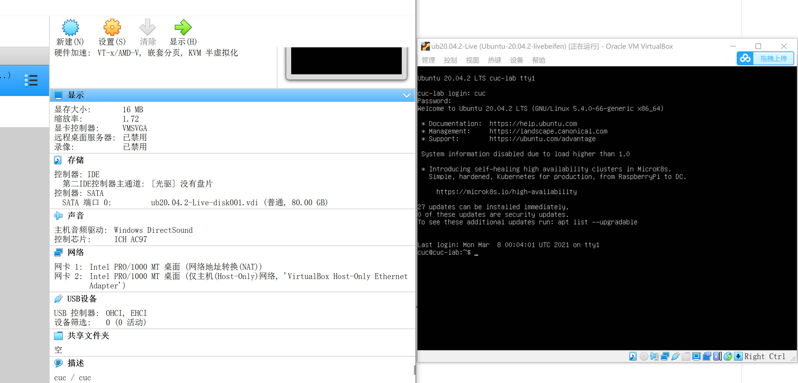

### 2.安装openssh&&内置帮助系统。

更新、安装openssh服务器，设置免密登录，安装手册页，使用命令如下：
``` 
sudo apt-get update 
sudo apt-get install -y openssh-server ssh-keygen -b 4096 
ssh-copy-id -i ~/.ssh/id_rsa.pub cuc@192.168.56.102
sudo apt-get install manpages-dev 
```

Windows端下载openssh客户端，通过ssh，利用ip地址将Linux远程连接。
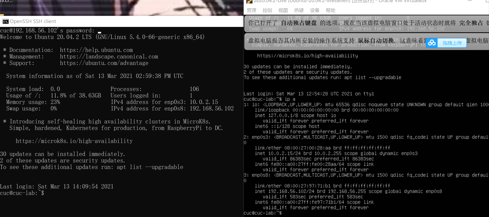

设置自己的用户名：
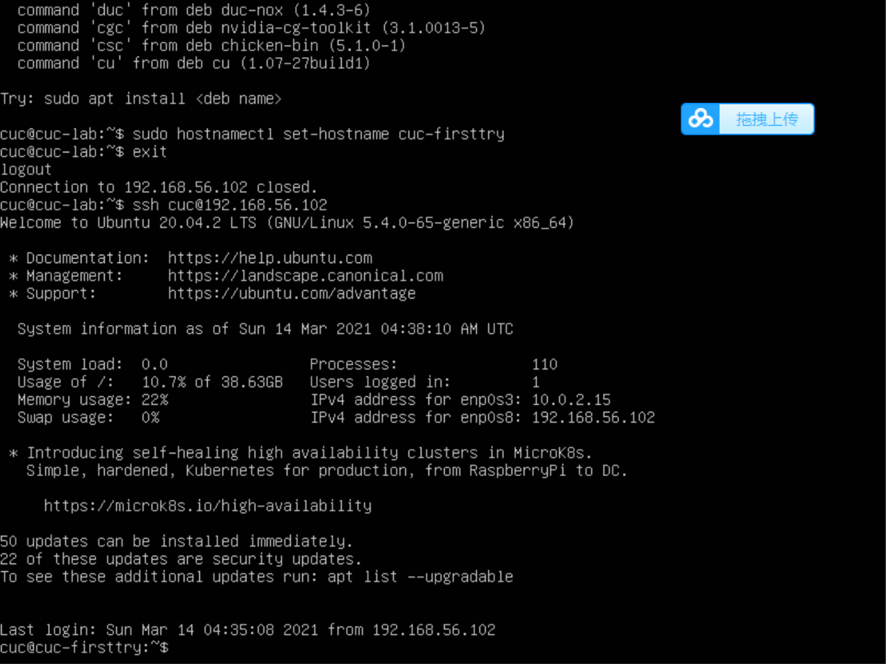


### 3.制作kiki-focal-init.iso.

提权，利用**scp**操作传输文件autoinstall-user-data到宿主机中:

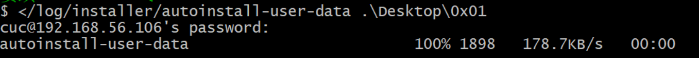 

并与实例文件加以比对，酌情修改，主要改动有：

- 修改timezone;
- 修改ssh;
- 修改timezone;
- 修改相应的size；
- 还删掉了一些示例文件中没有出现的部分。 

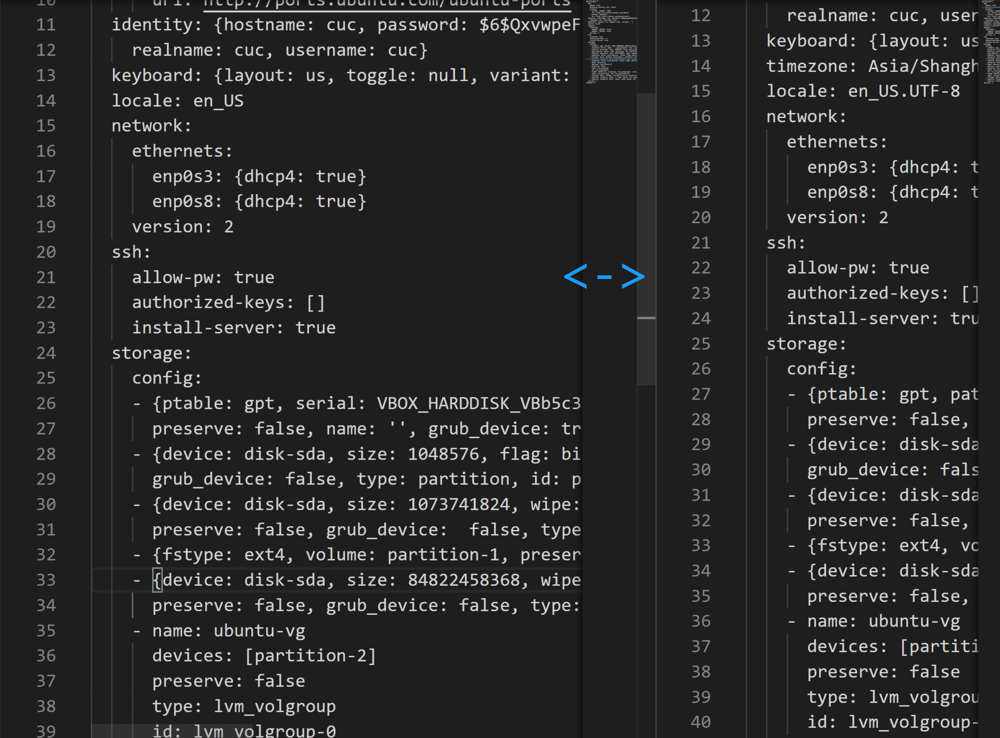

将修改过的user-data和设置为空的meta-data通过**sftp**从宿主机传输至虚拟机中：

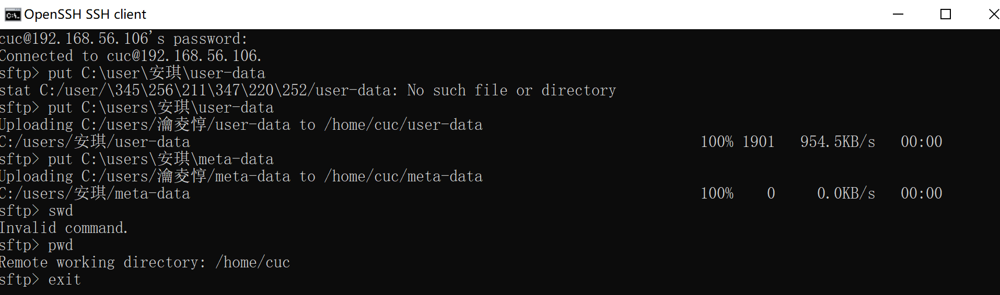


下载genisoimage,制作iso,命名为kiki-focal-init.iso并**scp**传回宿主机：

``cuc@cuc:~$ genisoimage -output kiki-focal-init.iso -volid cidata -joliet -rock user-data meta-data``

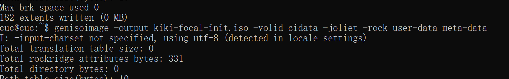
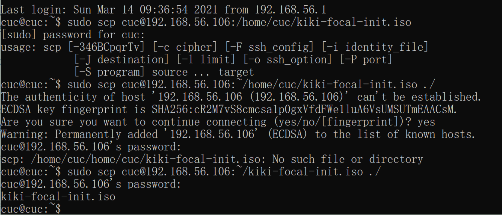

### 4.无人值守安装

新建虚拟机，移除控制器IDE，在控制器SATA下按顺序挂载纯净版**Ubuntu安装镜像文件**和**kiki-focal-init.iso**,检查网卡**NETWORK+HOST-ONLY**和存储配置：
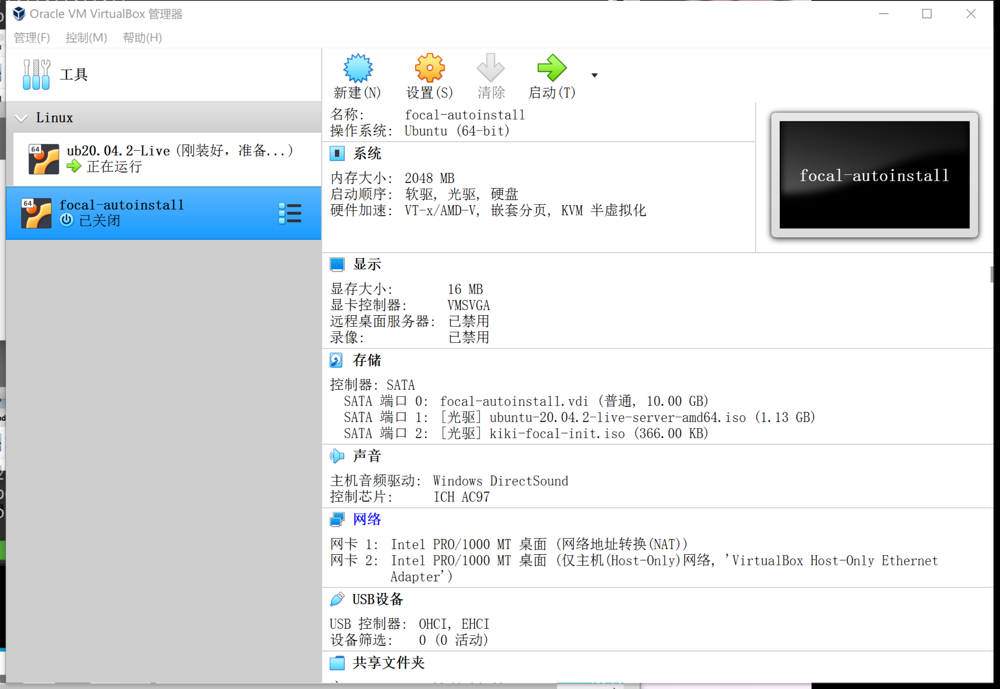

启动虚拟机，期间仅需手动输出一个yes：

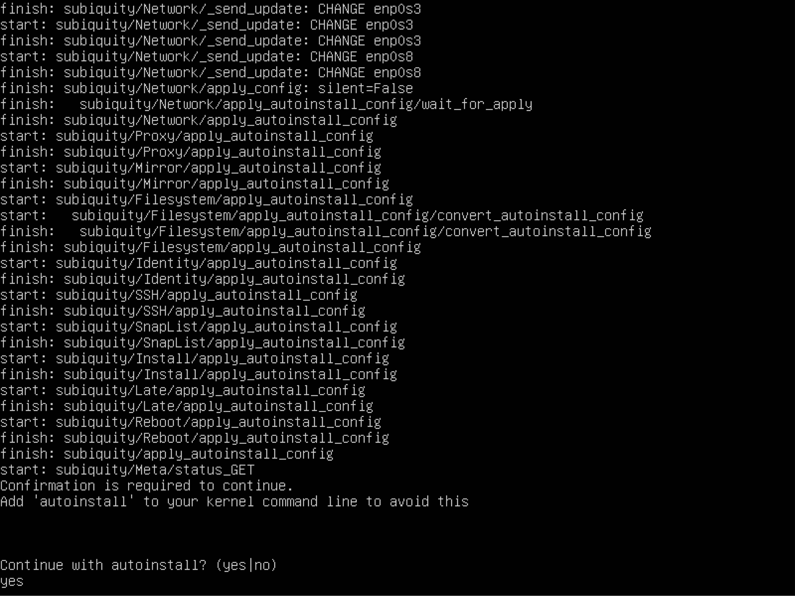


无人值守安装完毕。
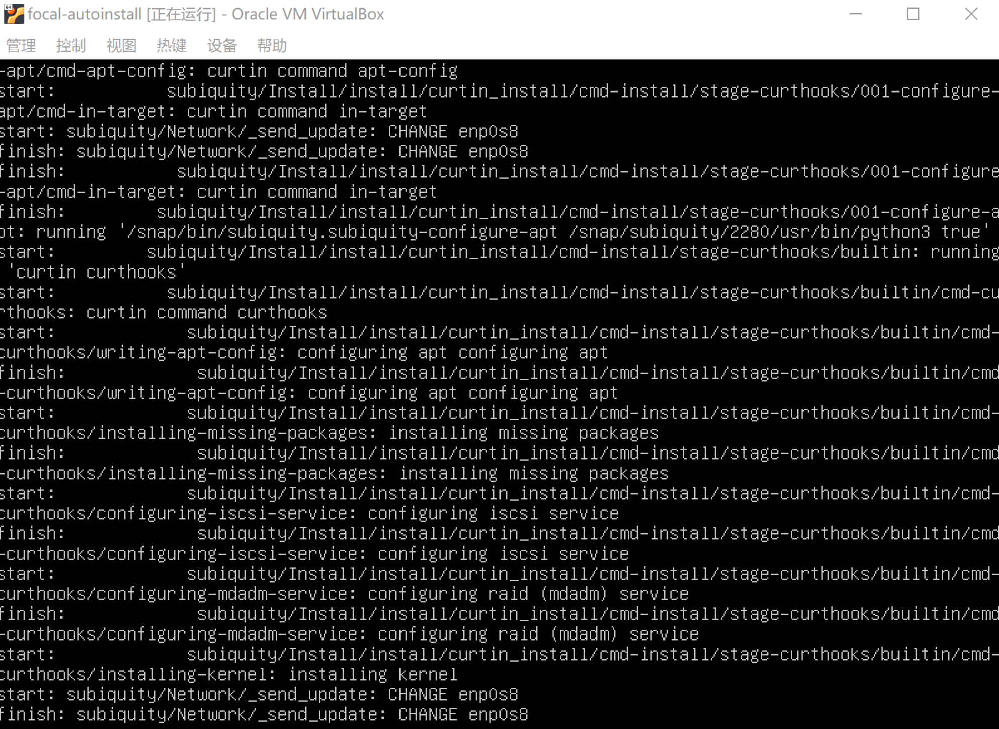

---
## 四、实验过程中遇到的问题及解决方法

1. 手动安装Ubuntu时网卡无法安装问题：
+ 显示错误：Failed to open/create the internal network 'HostInterfaceNetworking-VirtualBox Host-Only Ethernet...
+ 错误代码：E_FAIL(0x80004005)
+ 解决方法：检查网络适配器及其配置，更新对应网络适配器设备驱动并重新启动对应网络适配器设备
+ 参考文献：[Failed to open/create the internal network 'HostInterfaceNetworking-VirtualBox Host-Only Ethernet...](https://www.jianshu.com/p/4bee5f609d01)

2. 检查git_bush连接情况时出现警示
+ 警示内容：WARNING: terminal is not fully functional
+ 警示原因：git无法识别TERM变量的值
+ 操作情况：按照网页中更改了两次TERM的变量值，均无果，仍思考中。。
+ 参考文献：
  + [Why does git diff on Windows warn that the “terminal is not fully functional”?](https://stackoverflow.com/questions/7949956/why-does-git-diff-on-windows-warn-that-the-terminal-is-not-fully-functional)
  + [Robin's Blog
How to: Fix ‘WARNING: terminal is not fully functional’ error on Windows with Cygwin/Msysgit](http://blog.rtwilson.com/how-to-fix-warning-terminal-is-not-fully-functional-error-on-windows-with-cygwinmsysgit/)
- 最后，重新安装了一下git，问题得以解决。

3. 下载openssh_server_package时失败
- 错误原因：刚安装Ubuntu之后没有更新软件源
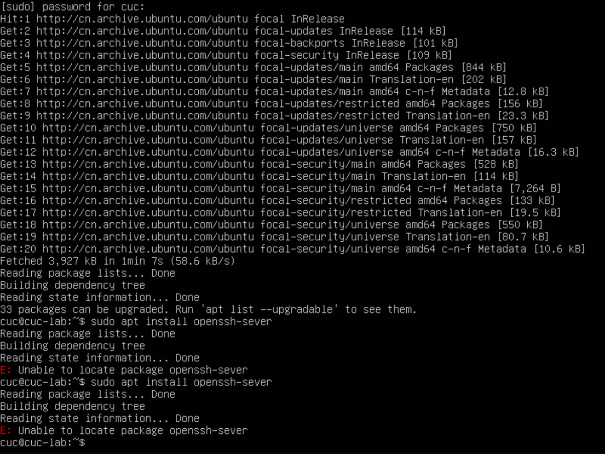
+ 解决方法：顺序输入命令
  `` sudo apt-get update``&&
  `` sudo apt-get upgrade``
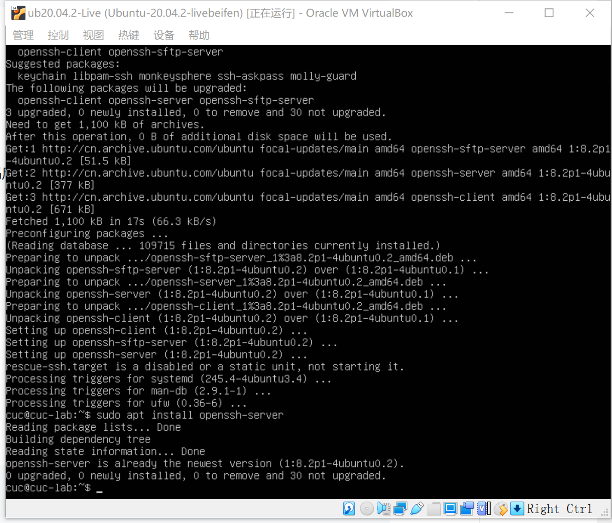


4. Ubuntu关机或重启时，提示需要30min
- 具体说明：a stop job is running for unattended upgrades shutdown
- 具体解决操作： 如下列文件所示，编辑系统文件设置defaulttimeoutstartsec=10s;defaulttimeoutstopsec=10s,但似乎保存失败，再次reboot时等了一下，好像也用不上所说的恐怖的30min，纯纯给整蒙了。。。
+ 参考文献：
  + [Ubuntu使用reboot重启时，提示a stop job is running for unattended upgrades shutdown的解决方法](https://blog.csdn.net/jianxin1021/article/details/105778496)
  + [18.04:a stop job is running for unattended upgrades shutdown](https://askubuntu.com/questions/1112009/18-04-a-stop-job-is-running-for-unattended-upgrades-shutdown)
  + [编辑sysctl.conf文件的方法](https://blog.csdn.net/u012674854/article/details/87182099)

5. 使用scp口令在宿主机和虚拟机之间复制粘贴文件时报错
- 报错内容：could not resolve hostname d: temporary failure in name resolution
  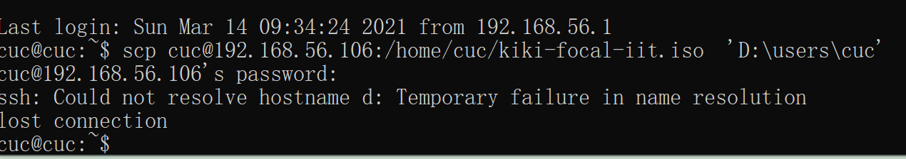
- 解决方案：查看主机名和ip地址是否对应,替换即可
+ 参考文献：
  + [ssh: Could not resolve hostname centos02: Temporary failure in name resolution](https://blog.csdn.net/mcb520wf/article/details/83303792)
  + [How to Resolve “Temporary failure in name resolution” Issue](https://www.tecmint.com/resolve-temporary-failure-in-name-resolution/)
  + [Linux篇 -- ssh: Could not resolve hostname XXX: Temporary failure in name resolution lost connection](https://blog.csdn.net/qq_38056704/article/details/93338172)

---
## 五、实验过程中其他的参考文档

- [课件仓库](https://github.com/c4pr1c3/LinuxSysAdmin/tree/master/exp/cloud-init/docker-compose)
- [直播回放](https://www.bilibili.com/video/BV1Hb4y1R7FE?p=28)
- [markdown书写](https://www.jianshu.com/p/399e5a3c7cc5)
- [cloud init](https://c4pr1c3.gitee.io/linuxsysadmin/cloud-init.md)
- [比对文件user-data](https://c4pr1c3.gitee.io/linuxsysadmin/exp/chap0x01/cd-rom/nocloud/user-data)


