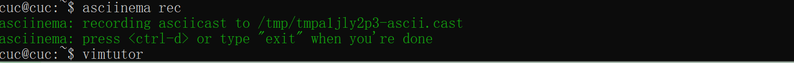
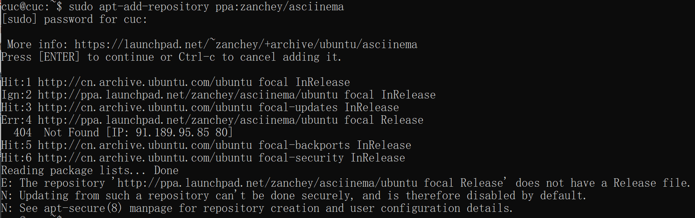
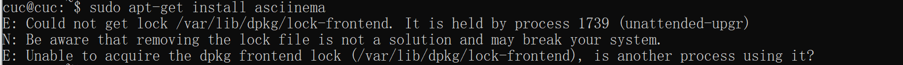
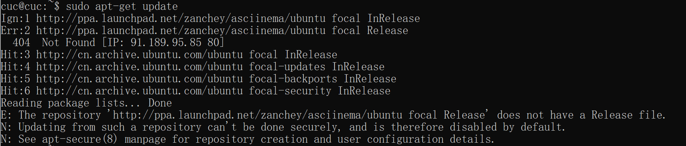

# 第二章实验 #
## 一、实验要求 ##
1. 确保本地已经完成asciinema auth，并在asciinema成功关联了本地账号和在线账号
2. 上传本人亲自动手完成的vimtutor操作全程录像
3. 在自己的github仓库上新建markdown格式纯文本文件附上asciinema的分享URL
4.   **提醒** 避免在终端操作录像过程中暴漏密码、个人隐私等任何机密数据

## 二、实验步骤： ##

1. 注册并下载asciinema
   `````
    sudo apt-add-repository ppa:zanchey/asciinema

    sudo apt-get update

    sudo apt-get install asciinema

   `````````
    关联：`` asciinema auth``

    录制：`` asciinema rec``

    
2. 完成vimtutor操作的录像
   + lesson1.1-2.7
    [](https://asciinema.org/a/InJYhMm95ySeHRRFWtIU95hFf)
   + lesson3.1-3.3
    [](https://asciinema.org/a/o5xPjdvCrcHsWVB9Rxvp6uMV7)
   + lesson3.4-4.4
    [](https://asciinema.org/a/pknMcHa8tlLXmkftzDH4RujqI)
   + lesson5.1-6.5
    [](https://asciinema.org/a/lB28OFrjWNOaxeZSmUDWCBTQy)
   + lesson7.1-7.2
    [](https://asciinema.org/a/jPcVlAu9F1Q2xnVXMTHhss9D6)
   + lesson7.3
    [](https://asciinema.org/a/HGxgJHvB3OXF4gIungI5XAm4G)

## 三、vimtutor自查清单 ##

1. vim的工作模式：
   
   - 正常模式、命令模式、插入模式、可视模式
1. Normal模式下，从当前行开始，一次向下移动光标10行的操作方法？如何快速移动到文件开始行和结束行？如何快速跳转到文件中的第N行？
   - 下移十行：10j
   - 快速移动到开始行、结束行：gg\G
   - 快速跳转至N行：NG\Ngg
2. Normal模式下，如何删除单个字符、单个单词、从当前光标位置一直删除到行尾、单行、当前行开始向下数N行？
   - 单个字符：x\dl
   - 单个单词：dw
   - 删到行尾：d$\D
   - 删单行：dd
   - 当前行下数N行：Ndd
3. 如何在vim中快速插入N个空行？如何在vim中快速输入80个-？
   - 向上插入：NO  
   - 向下插入：No  
   - 80i- + [esc]
4. 如何撤销最近一次编辑操作？如何重做最近一次被撤销的操作？
   - u
   - [ctrl] + r
5. vim中如何实现剪切粘贴单个字符？单个单词？单行？如何实现相似的复制粘贴操作呢？
   - 单个字符：x + p
   - 单个单词：dw + p
   - 单行：dd + p
   - 相似的复制粘贴：v进入可视模式，y复制，p粘贴
6. 为了编辑一段文本你能想到哪几种操作方式（按键序列）？
   - 插入内容： a\A\o
   - 删除字符： w\x\dd\dw\d$
   - 替换内容： r
   - 复制： y
   - 粘贴： p
   - 撤销：u
   - 恢复：U
   - 撤销撤销：[ctrl] + r
   - 剪切：d
7. 查看当前正在编辑的文件名的方法？查看当前光标所在行的行号的方法？
   - :f/:e
   - [ctrl] + G
8.  在文件中进行关键词搜索你会哪些方法？如何设置忽略大小写的情况下进行匹配搜索？如何将匹配的搜索结果进行高亮显示？如何对匹配到的关键词进行批量替换？
    - /关键词
    - :set ic
    - :set hls is
    - :%s/被替换词/替换词/g
9.  在文件中最近编辑过的位置来回快速跳转的方法？
    - 向前跳转：[ctrl] + O
    - 向后跳转：[ctrl] + I
10. 如何把光标定位到各种括号的匹配项？例如：找到(, [, or {对应匹配的),], or }
    先把光标放在要操作的符号上，然后输入%找到该符号的相应匹配项。
11. 在不退出vim的情况下执行一个外部程序的方法？
    :! + 外部程序命令
12. 如何使用vim的内置帮助系统来查询一个内置默认快捷键的使用方法？如何在两个不同的分屏窗口中移动光标？
    - :help + 要查询的快捷键
    - ([ctrl] + W) + W


## 四、实验中错误更正 ##
1. 错误情况：下载asciinema时出现错误，导致无法运行install的三条命令
   
   
   
2. 解决情况: 经助教和老师帮助后，参考[网页](https://blog.csdn.net/qq_38019633/article/details/84024309)，输入命令``` sudo rm /var/lib/dpkg/lock ```解开系统锁，直接执行安装命令，即可进行实验。


## 五、参考文献 ##
- [课件](https://c4pr1c3.gitee.io/linuxsysadmin/chap0x02.exp.md.html#/1/3)
- [what-can-i-do-if-a-repository-ppa-does-not-have-a-release-file](https://askubuntu.com/questions/866901/what-can-i-do-if-a-repository-ppa-does-not-have-a-release-file)


